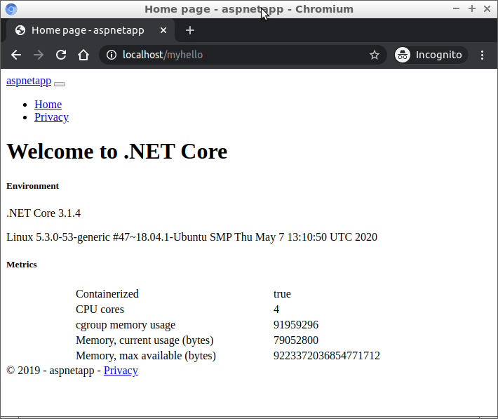

# Setting up [Traefik](https://traefik.io/) as a reverse-proxy with dotnet

There is a bash script to create the reverse proxy <a href="./traefik-reverse-proxy-setup.sh" >here </a>

Related:
* [setting-up-traefik-as-a-reverse-proxy-for-asp-net-applications](https://blog.codeship.com/setting-up-traefik-as-a-reverse-proxy-for-asp-net-applications/)

<b> My Minimum requirements </b>

    $ lsb_release -a
    No LSB modules are available.
    Distributor ID:	Ubuntu
    Description:	Ubuntu 18.04.4 LTS
    Release:	18.04
    Codename:	bionic

    $ sudo docker --version
    Docker version 19.03.9, build 9d988398e7

    $ sudo docker-compose --version
    docker-compose version 1.25.5, build 8a1c60f6

    $ dotnet --version
    3.1.300

## 1. Create a web frontend as a docker image

#### Create the site
We need a web project that we can utilise in a container. For simplicity, we choose the default mvc app and we call it `myhello`. The project will take its name from its current directory so we therefore create a directory called `myhello` first and then the mvc project within it. This will create a minimal site with models, views and controllers.

    $ mkdir myhello
    $ cd myhello
    $ dotnet new mvc
    The template "ASP.NET Core Web App (Model-View-Controller)" was created successfully.
    This template contains technologies from parties other than Microsoft, see https://aka.ms/aspnetcore-template-3pn-210 for details.
    $

We can publish this site:

    ~/myhello $ dotnet publish --configuration=Release
    Microsoft (R) Build Engine version 16.6.0+5ff7b0c9e for .NET Core
    Copyright (C) Microsoft Corporation. All rights reserved.

    Determining projects to restore...
    All projects are up-to-date for restore.
    myhello -> /home/samuelh/codeprojects/myhello/bin/Release/netcoreapp3.1/myhello.dll
    myhello -> /home/samuelh/codeprojects/myhello/bin/Release/netcoreapp3.1/myhello.Views.dll
    myhello -> /home/samuelh/codeprojects/myhello/bin/Release/netcoreapp3.1/publish/

    $

    
We now have a deployable application in the `publish/` folder

    ~/myhello/bin/Release/netcoreapp3.1/publish $ ls
    appsettings.Development.json  myhello            myhello.dll  myhello.runtimeconfig.json  myhello.Views.pdb  wwwroot
    appsettings.json              myhello.deps.json  myhello.pdb  myhello.Views.dll           web.config
    $

#### Create the docker image

We want to take the `myhello` application and package it in a docker image. For that, we need a `dockerfile`. Create a file called `dockerfile` in `~/myhello` with the following content:

    FROM mcr.microsoft.com/dotnet/core/aspnet:3.1
    WORKDIR /inetpub/wwwroot
    COPY bin/Release/netcoreapp3.1/ ./
    EXPOSE 80
    ENTRYPOINT ["dotnet", "myhello.dll"]

We can also create this directly from the command line:

    $ cd ~/myhello;
    echo '
    FROM mcr.microsoft.com/dotnet/core/aspnet:3.1
    WORKDIR /inetpub/wwwroot
    COPY bin/Release/netcoreapp3.1/ ./
    EXPOSE 80
    ENTRYPOINT ["dotnet", "myhello.dll"] ' > dockerfile

This will use the `microsoft/dotnet` as the base image, copy the files from the `publish/` folder to `/inetpub/wwwroot` inside the image, open up port 80 and run the application.

We can now build this image:

    ~/myhello $ sudo docker build -t myhello .

    Step 1/5 : FROM mcr.microsoft.com/dotnet/core/aspnet:3.1
    ---> 4bee399eb313
    Step 2/5 : WORKDIR /inetpub/wwwroot
    ---> Using cache
    ---> 6575adbf868e
    Step 3/5 : COPY bin/Release/netcoreapp3.1/ ./
    ---> Using cache
    ---> f2202ae077d8
    Step 4/5 : EXPOSE 80
    ---> Using cache
    ---> 4eb6fa1d769d
    Step 5/5 : ENTRYPOINT ["dotnet", "myhello.dll"]
    ---> Using cache
    ---> 722b50d4232d
    Successfully built 722b50d4232d
    Successfully tagged myhello:latest
    $

## 2. Wire it up with docker-compose

Now we need to assemble everything together and use traefik as a reverse proxy.

Create a file called `traefik-reverse-proxy-compose.yml`. In it, add the following content

    version: "3.1"
    services:
    frontend:
        image: traefik:v1.7
        command: --api --docker --logLevel=DEBUG
        ports:
            - "80:80"
            - "443:443"

    # Expose the Traefik web UI on port 8080. We restrict this
    # to localhost so that we don't publicly expose the
    # dashboard.
            - "127.0.0.1:8080:8080"
        volumes:
            - "/var/run/docker.sock:/var/run/docker.sock"
        labels:
            - "traefik.enable: False"

This will create the traefik container.

Create another file called `myhello-compose.yml`. Use this content:

    version: "3.1"
    services:

        myhello:
            image: myhello
            labels:        
                - "traefik.backend=myhello-web"      

                # This will redirect /myhello to /myhello/
                # https://docs.traefik.io/user-guide/examples/
                # The very last example shows how to redirect from /myhello to /myhello/
                - "traefik.frontend.redirect.regex=^(.*)/myhello$$"
                - "traefik.frontend.redirect.replacement=$$1/myhello/"      
                - "traefik.frontend.rule=PathPrefix:/myhello;ReplacePathRegex: ^/myhello/(.*) /$$1"

                - "traefik.enable: True"
                - "traefik.port: 80"

We use the `myhello` image we created earlier. We name the traefik backend to `myhello-web`. This allows us to scale and add more `myhello` containers later on if necessary. We enable this container so that it can receive requests on port 80.

#### Start `traefik` container

    ~/myhello $ sudo docker-compose -f traefik-reverse-proxy-compose.yml up -d
    Starting tmp_frontend_1 ... done
    $

#### Start `nyhello` container

    ~/tmp $ sudo docker-compose -f myhello-compose.yml up -d
    Creating myhello_myhello_1 ... done
    $

Open the favourite browser and go to `http://localhost/myhello`

We should see something like this:

We can shut the containers down with 

    ~/myhello $ sudo docker-compose -f myhello-compose.yml down
    Removing myhello_myhello_1 ... done
    Removing network myhello_default
    ERROR: error while removing network: network myhello_default id ea09ec58c03fcc28280b4580419b5fc7cd60453658423619417f90055ba20120 has active endpoints
    $

The error occurs because the traefik container is still using the network which is expected.

Shutting down `traefik`:

    ~/myhello $ sudo docker-compose -f traefik-reverse-proxy-compose.yml down
    Stopping myhello_frontend_1 ... done
    Removing myhello_frontend_1 ... done
    Removing network myhello_default
    $
